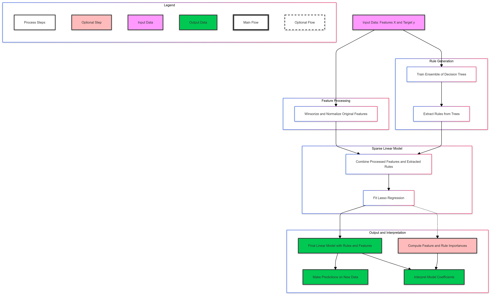
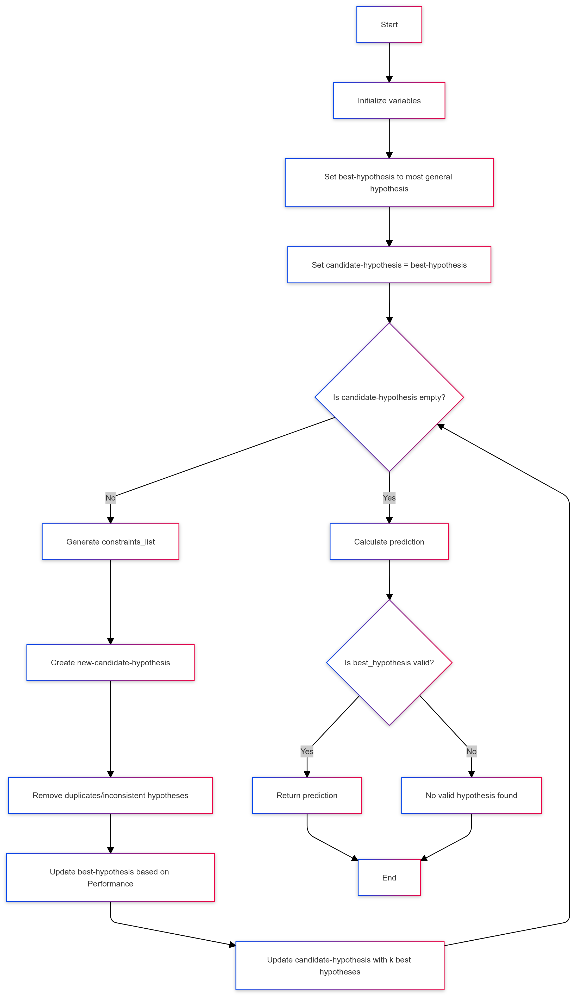

# Interpretable Models using iModels Library

This repository contains implementations of various interpretable machine learning algorithms using the [iModels library](https://github.com/csinva/imodels). Each notebook demonstrates the application of a different algorithm on a specific dataset, with a focus on model interpretability.

## Algorithms

### 1. **RuleFit Algorithm**
   - **Dataset**: [Salary Prediction Dataset](https://www.kaggle.com/datasets/rkiattisak/salaly-prediction-for-beginer)
   - **Notebook**: `notebooks/rule_fit_algorithm.ipynb`
   - **Description**: The RuleFit algorithm is a hybrid model that combines linear models with decision rules extracted from trees, allowing it to capture both linear and non-linear relationships while maintaining interpretability. In this notebook, the model is applied to the Salary Prediction dataset to show how different features (like Age, Years of Experience, Education Level) impact the salary.

   

### 2. **OneR Algorithm**
   - **Dataset**: [Zomato Dataset](https://www.kaggle.com/datasets/rishikeshkonapure/zomato/data)
   - **Notebook**: `notebooks/oneR_algorithm.ipynb`
   - **Description**: OneR is a rule-based classifier that generates a single, simple rule for classification, making it one of the most interpretable models available. This notebook uses the Zomato dataset to classify whether restaurants offer online orders based on features like cost, location, and cuisine type.

   

### 3. **Hierarchical Shrinkage**
   - **Dataset**: Cleaned `credit_card_clean` dataset from the iModels library.
   - **Notebook**: `notebooks/hierarchical_shrinkage.ipynb`
   - **Description**: Hierarchical shrinkage is a technique that regularizes predictions by incorporating hierarchical relationships between features. This helps prevent overfitting while improving interpretability. The notebook demonstrates this technique on a credit card dataset, showcasing how it can be used for real-world prediction tasks.

   [Download the Hierarchical Shrinkage Storybook](./visuals/HRT.pdf)

## Installation

To run this project go to the main notebook and simply open them in Google Colab using the provided link. 

## Datasets

- **Salary Data**: Available [here](https://www.kaggle.com/datasets/rkiattisak/salaly-prediction-for-beginer).
- **Zomato Data**: Available [here](https://www.kaggle.com/datasets/rishikeshkonapure/zomato/data).
- **Credit Card Data**: Part of the iModels library.

## Acknowledgements

- **iModels Library**: [GitHub Repository](https://github.com/csinva/imodels) — A library for concise and interpretable machine learning models.
- **Datasets**: Datasets are sourced from Kaggle and the iModels library.
- **Images**: DALLE and Claude used for image generation